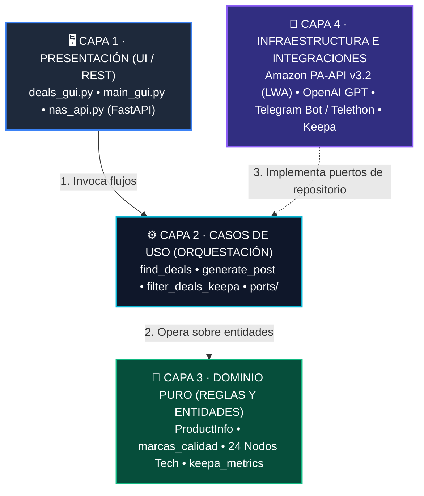

<div align="center">

  <p align="center">
    
    &nbsp;&nbsp;&nbsp;&nbsp;&nbsp;&nbsp;
    <picture>
      <source media="(prefers-color-scheme: dark)" srcset="assets/amazon_logo_white.png">
      <source media="(prefers-color-scheme: light)" srcset="assets/Amazon-Logo-2000-500x281.png">
      
    </picture>
  </p>

  # Amazon-Api-Apps
  
  **Suite integral de ingeniería para la detección algorítmica de chollos en Amazon, validación histórica de precios, redacción asistida con IA y publicación automatizada en Telegram.**

  [](https://www.python.org/)
  [](#-arquitectura-y-diseño)
  [](#-calidad-y-testing)
  [](https://fastapi.tiangolo.com/)
  [](#-aplicaciones-de-escritorio)
  [](#-despliegue-con-docker-nas)
  [](LICENSE)

  <br />

  <p align="center">
    <a href="#-en-un-vistazo">En un Vistazo</a> •
    <a href="#-flujo-de-datos">Flujo de Datos</a> •
    <a href="#-aplicaciones-de-escritorio">Aplicaciones</a> •
    <a href="#-arquitectura-y-diseño">Arquitectura</a> •
    <a href="#-inicio-rápido">Inicio Rápido</a> •
    <a href="#-configuración-env">Configuración</a> •
    <a href="#-empaquetado-exe">Compilación .EXE</a>
  </p>

</div>

---

## ⚡ En un Vistazo

| 🎯 Buscador Algorítmico | 🤖 Copywriting con IA | 💎 Telegram Premium |
|:---|:---|:---|
| • **24 categorías tech** sondeadas en vivo.<br>• Rotación de **5 estrategias SortBy**.<br>• Barrido por **marcas TOP de calidad**.<br>• Detección automática de **fin de oferta**. | • Síntesis persuasiva con **GPT-4o-mini**.<br>• Copys de venta directos de 2-3 líneas.<br>• Extracción de características clave.<br>• Asignación inteligente de **#hashtags**. | • Formato nativo **HTML** con negritas y tachados.<br>• Emojis animados premium con `<tg-emoji>`.<br>• Carrusel de hasta **7 fotografías** HD.<br>• Enlaces limpios con tag de afiliado. |

> [!NOTE]
> **Diseñado para producción:** El proyecto no es un script suelto de scraping. Es un ecosistema estructurado con **Clean Architecture estricta**, separación por capas (`Domain`, `Use Cases`, `Services`, `Integrations`, `UI`), 99 pruebas automatizadas unitarias/integración y tolerancia a fallos en red.

---

## 🔄 Flujo de Datos

El ciclo de vida de un chollo, desde su detección algorítmica en Amazon hasta su impacto en Telegram:

<div align="center">

```
🛒 1. Extracción (Amazon API)  ➔  🧠 2. Filtrado (Reglas + Keepa)  ➔  🤖 3. Redacción (GPT-4o)  ➔  📢 4. Publicación (Telegram + GUI)
```

</div>

| Paso | Etapa | Proceso y Lógica del Sistema | Componentes Clave |
|:---:|:---|:---|:---|
| **01** | **🛒 Extracción** | • Rotación por **5 estrategias `SortBy`** para superar los límites de paginación de la API.<br>• Barrido segmentado por **marcas TOP de calidad**.<br>• Deduplicación estricta por ASIN. | Amazon Creators API v3.2<br>`Login with Amazon (LWA)` |
| **02** | **🧠 Validación** | • Filtro de umbral de descuento (≥ 15% y ofertas flash con caducidad).<br>• Priorización inmediata de primeras marcas (`MARCAS_CALIDAD`).<br>• Auditoría histórica con **Keepa (90 días)** para descartar rebajas infladas. | Reglas de Dominio Puro<br>`Keepa Price Engine` |
| **03** | **🤖 Copywriting** | • Síntesis persuasiva de características técnicas en 2-3 líneas directas de venta.<br>• Tono comercial limpio optimizado para lectura rápida en móvil.<br>• Asignación automática de categorías y `#hashtags`. | OpenAI API<br>`GPT-4o-mini` |
| **04** | **🚀 Distribución** | • **Buscador Desktop:** Exploración analítica y visualización de gráficas.<br>• **Publicador Desktop:** Selector de carrusel de hasta 7 fotos y envío manual.<br>• **Telegram Channel:** Post con formato HTML, negritas y `<tg-emoji>`.<br>• **NAS Server REST:** Automatizaciones programadas con Docker en segundo plano. | Tkinter / ttkbootstrap<br>Telegram Bot API<br>FastAPI + Docker |

---

## 🖥️ Aplicaciones de Escritorio

El repositorio incluye dos aplicaciones de escritorio nativas construidas con **Tkinter + ttkbootstrap** para Windows:

### 1. 🎯 Buscador de Chollos (`run_deals_gui.py`)
> **Modo solo consulta:** Monitoriza y detecta gangas masivas en Amazon sin publicar nada.

| Sección | Elementos y Funcionalidad en Pantalla |
|:---|:---|
| **Filtros Superiores** | Selector de **24 Categorías Tech** · Rango de descuento (`Min %` y `Max %`) · Límite de resultados (`Max`). |
| **Acciones Rápidas** | `⚡ Buscar TODOS los Chollos` (barrido 24 nodos) · `⭐ Filtrar por Calidad` · `📅 Ordenar por Caducidad` · `📂 Cargar JSON`. |
| **Tabla de Gangas** | Columnas ordenables: **Descuento (%)** · **Marca (★ Calidad en verde)** · **Producto** · **Precio Actual**. |
| **Panel de Inspección** | Gráfica de precio histórico Keepa · Aviso de oferta flash (`⏳ Expira en...`) · Apertura directa en Amazon España. |

#### Ejemplo de Resultados en la Tabla

| Descuento | Marca | Producto Seleccionado | Precio Actual | Estado / Caducidad |
|:---:|:---:|:---|:---:|:---:|
| **-45 %** | `★ Crucial` | SSD P3 Plus 2TB PCIe M.2 NVMe (5000 MB/s) | **99,99 €** | ⏳ Expira en 12 horas |
| **-38 %** | `★ Logitech G` | Ratón Gaming Inalámbrico G PRO X Superlight | **89,00 €** | 📊 Mínimo histórico 90d |
| **-32 %** | `★ Sony` | Auriculares WH-1000XM5 Cancelación de Ruido | **269,00 €** | 📊 Descuento real validado |

- **24 Categorías Tech:** Índices y `BrowseNodeId` sondeados en vivo para evitar categorías vacías.
- **Marcas de Calidad destacadas con ★:** Identificación visual inmediata de primeras marcas frente a genéricos.
- **Gráfica de Tendencia Keepa:** Renderizado del histórico de precios para evitar falsos descuentos inflados.
- **Exportación/Importación:** Guarda los barridos en `data/max_ofertas_*.json` para revisarlos offline.

---

### 2. 📤 Publicador BuenChollo (`run_gui.py`)
> **Estación editorial:** Transforma un enlace o ASIN en un post premium y lo envía al canal.

| 📦 Panel de Edición y Datos (Desktop GUI) | 👁️ Previsualización del Post en Telegram |
|:---|:---|
| **Extracción Automática:**<br>Pega cualquier enlace (`amzn.to` o ASIN) y extrae al instante título, precio anterior, precio rebajado, descuento y fecha de expiración.<br><br>**Carrusel Multimedia:**<br>Selector visual de hasta 7 fotos oficiales en alta resolución o subida de captura personalizada.<br><br>**Copywriting con IA:**<br>Generación en un clic de resumen comercial persuasivo mediante GPT-4o-mini.<br><br>**Etiquetado Inteligente:**<br>Asignación automática de categorías del catálogo (`#Almacenamiento`, `#SSD`, `#Gaming`).<br><br>**Publicación Directa:**<br>`[ 🚀 Publicar en Canal de Pruebas ]`<br>`[ 📢 Publicar en CANAL PRINCIPAL ]` | 🔥 **Crucial P3 Plus 2TB M.2 PCIe 4.0**<br>━━━━━━━━━━━━━━━━━━━━━━━━━━━━<br>⚡ *Velocidades brutales de hasta 5.000 MB/s. Ideal para cargas ultrarrápidas en gaming y edición pesada.*<br>━━━━━━━━━━━━━━━━━━━━━━━━━━━━<br>❌ Antes: ~~179,99€~~<br>💥 Ahora: **99,99€** `[-44%]` *(Ahorras 80,00€)*<br>⏳ Finaliza: **Hoy a las 23:59**<br>🛒 `https://amzn.to/ejemplo-afiliado`<br><br>#Almacenamiento #SSD #Gaming |

---

## 🏛️ Arquitectura y Diseño

El proyecto respeta escrupulosamente los principios de **Clean Architecture** (Arquitectura Cebolla / Puertos y Adaptadores):



| Capa Arquitectónica | Módulos Principales | Responsabilidad y Reglas de Diseño |
|:---|:---|:---|
| **1. Presentación** | `deals_gui.py` · `main_gui.py` · `nas_api.py` | **Sin lógica de negocio.** Captura entradas de usuario o peticiones REST y delega en casos de uso mediante hilos secundarios (`threading.Thread`) para mantener la interfaz fluida. |
| **2. Casos de Uso** | `find_deals.py` · `generate_post.py` · `filter_deals_keepa.py` · `ports/` | **Orquesta los flujos de negocio.** Recibe repositorios e integraciones por constructor mediante **Inyección de Dependencias (DI)** a través de interfaces abstractas. |
| **3. Dominio Puro** | `ProductInfo` · `marcas_calidad.py` · `categories_search_index.py` · `keepa_metrics.py` | **Núcleo aislado.** Cero dependencias externas y sin I/O. Algoritmos deterministas de descuento real, catálogo de 24 nodos tech y normalización de marcas. |
| **4. Integraciones** | Amazon Creators v3.2 (LWA) · OpenAI · Telegram Bot / Telethon · Keepa · Storage | **Adaptadores de infraestructura.** Implementan los contratos de los puertos. Gestionan la caché de tokens OAuth en memoria y capturan fallos de red con trazabilidad. |

### Principios Clave
1. **Dominio Agnóstico (`src/domain/`):** Cero dependencias de librerías externas o I/O. Las reglas para calcular porcentajes, normalizar marcas o evaluar la media de precios son funciones deterministas y testeables.
2. **Inversión de Dependencias (`src/use_cases/ports/`):** Los casos de uso no conocen los detalles técnicos de Amazon ni de Telegram; dependen de interfaces abstractas.
3. **UI sin lógica de negocio (`src/ui/`):** La interfaz gráfica únicamente captura eventos de usuario, invoca casos de uso en hilos (`threading.Thread`) para evitar bloqueos y actualiza widgets.
4. **Manejo Centralizado de Excepciones (`src/integrations/`):** Los errores de red o cuota se capturan y registran mediante `logging`, retornando fallbacks seguros.

---

## 📁 Estructura del Repositorio

```
Amazon-Api-Apps/
├── assets/                    # Iconos y logotipos oficiales de la aplicación
├── data/                      # Catálogo base de categorías y hashtags
│   └── categories.json
├── deploy/                    # Configuración para despliegue autónomo
│   ├── Dockerfile.nas
│   ├── docker-compose.yml
│   └── GUIA_SYNOLOGY.md
├── docs/                      # Documentación técnica extendida
│   ├── ARQUITECTURA.md        # Desglose de capas y módulos
│   ├── FUNCIONALIDAD.md       # Detalle de vistas y flujos
│   ├── DESARROLLO.md          # Guía para desarrolladores
│   ├── buscador_chollos.md    # Diseño del motor de búsqueda
│   └── KeepaImplementacion.md # Métricas y fórmulas Keepa
├── scripts/                   # Herramientas de exploración y barrido CLI
│   ├── explore_search_nodes.py
│   └── test_busqueda_max_ofertas.py
├── src/                       # Código fuente modular
│   ├── cli/                   # Comandos de consola
│   ├── config/                # Gestor de configuración y variables de entorno
│   ├── domain/                # Entidades y reglas puras
│   ├── formatters/            # Transformadores de texto y diseño Telegram
│   ├── integrations/          # Clientes externos (Amazon LWA, OpenAI, Telethon, Keepa)
│   ├── server/                # API REST (FastAPI) para ejecución headless
│   ├── services/              # Fachadas internas de servicio
│   ├── ui/                    # Vistas de escritorio (ttkbootstrap)
│   └── use_cases/             # Casos de uso + interfaces de puertos
├── tests/                     # Suite de pruebas automatizadas
│   ├── unit/                  # Tests unitarios de dominio y formateo
│   └── integration/           # Tests de integración de casos de uso
├── .dockerignore              # Aislamiento de imagen Docker
├── .env.example               # Plantilla segura de variables de entorno
├── .gitignore                 # Exclusión de secretos y temporales
├── BuscarChollos.spec         # PyInstaller spec para Buscador de Chollos
├── PublicadorBuenChollo.spec  # PyInstaller spec para Publicador
├── LICENSE                    # Licencia MIT
├── requirements.txt           # Dependencias completas del ecosistema
├── run_deals_gui.py           # Lanzador: Buscador de Chollos
└── run_gui.py                 # Lanzador: Publicador de Ofertas
```

---

## 🚀 Inicio Rápido

### 1. Clonar el repositorio
```bash
git clone https://github.com/Zambudio/Amazon-Api-Apps.git
cd Amazon-Api-Apps
```

### 2. Crear y activar el entorno virtual
```powershell
# En Windows (PowerShell):
python -m venv .venv
.\.venv\Scripts\Activate.ps1

# En Linux / macOS:
python3 -m venv .venv
source .venv/bin/activate
```

### 3. Instalar dependencias
```bash
pip install --upgrade pip
pip install -r requirements.txt
```

### 4. Configurar tus credenciales
```powershell
Copy-Item .env.example .env    # En Windows
# cp .env.example .env         # En Linux/macOS
```
Abre `.env` y añade tus credenciales (consulta la sección [Configuración](#-configuración-env)).

### 5. Lanzar las aplicaciones
```powershell
# Iniciar el Buscador de Chollos:
python run_deals_gui.py

# Iniciar el Publicador a Telegram:
python run_gui.py
```

---

## ⚙️ Configuración (.env)

El proyecto incluye la plantilla documentada [`.env.example`](.env.example). Las variables principales son:

| Servicio | Variable | Obligatoria | Descripción |
|---|---|:---:|---|
| **Amazon LWA** | `AMAZON_CLIENT_ID` | **Sí** | Client ID obtenido en el portal de afiliados de Amazon. |
| **Amazon LWA** | `AMAZON_CLIENT_SECRET` | **Sí** | Client Secret de Login with Amazon (LWA). |
| **Amazon LWA** | `AMAZON_AFFILIATE_TAG` | **Sí** | Tu tag de afiliado (ej: `mitag-21`). |
| **Telegram** | `TELEGRAM_BOT_TOKEN` | **Sí** | Token HTTP creado con [@BotFather](https://t.me/BotFather). |
| **Telegram** | `TELEGRAM_ADMIN_CHANNEL_ID` | **Sí** | ID numérico del canal de revisión previa (`-100...`). |
| **Telegram** | `TELEGRAM_MAIN_CHANNEL_ID` | No | ID numérico del canal público final (`-100...`). |
| **OpenAI** | `OPENAI_API_KEY` | No | Clave de OpenAI para redactar descripciones automáticas. |
| **Keepa** | `KEEPA_API_KEY` | No | Clave de Keepa para calcular media histórica de 90 días. |
| **Telethon** | `TELEGRAM_USER_API_ID` | No | App ID para leer canales antiguos ([my.telegram.org](https://my.telegram.org)). |
| **Telethon** | `TELEGRAM_USER_API_HASH` | No | App Hash para Telethon. |

> [!TIP]
> Si no dispones de clave de OpenAI o Keepa, la aplicación utiliza **mecanismos de fallback inteligentes**: extrae la primera característica técnica del producto y omite el filtro de precio histórico sin interrumpir la búsqueda.

---

## 📦 Empaquetado (.EXE)

El proyecto incluye especificaciones optimizadas para **PyInstaller** que generan ejecutables portables e independientes para Windows:

```powershell
# Compilar Buscador de Chollos:
pyinstaller BuscarChollos.spec --noconfirm
# Resultado: dist/BuscarChollos/BuscarChollos.exe

# Compilar Publicador de Ofertas:
pyinstaller PublicadorBuenChollo.spec --noconfirm
# Resultado: dist/PublicadorBuenChollo/PublicadorBuenChollo.exe
```

*Los archivos `.spec` están configurados para aislar las claves privadas: el `.exe` leerá el `.env` ubicado en su misma carpeta sin incrustar secretos en los binarios.*

---

## 🐳 Despliegue con Docker (NAS)

Para mantener un servicio continuo en segundo plano sobre un servidor doméstico o NAS (Synology, QNAP, TrueNAS o VPS Linux):

```bash
docker-compose -f deploy/docker-compose.yml up -d --build
```

- **Puerto expuesto:** `8000` (FastAPI REST API).
- **Documentación Swagger interactiva:** `http://<IP-DEL-NAS>:8000/docs`.
- **Instrucciones completas:** Consulta [`deploy/GUIA_SYNOLOGY.md`](deploy/GUIA_SYNOLOGY.md).

---

## 🧪 Calidad y Testing

El repositorio incorpora una batería completa de pruebas que valida toda la lógica de negocio sin realizar llamadas de red reales (mediante mocks estructurados):

```powershell
# Ejecutar toda la suite:
pytest

# Ejecución rápida y limpia:
pytest -q

# Pruebas unitarias de dominio:
pytest tests/unit -q
```

```text
============================= test session starts =============================
collected 99 items

tests/unit/test_amazon_api.py .........                                  [  9%]
tests/unit/test_deals_gui.py .........                                   [ 18%]
tests/unit/test_filter_chollos_calidad.py ...............                [ 33%]
tests/unit/test_filter_deals_keepa.py .................                  [ 50%]
tests/unit/test_find_deals.py ..............                             [ 64%]
tests/unit/test_formatters.py ........                                   [ 72%]
tests/unit/test_keepa_metrics.py ............                            [ 84%]
tests/unit/test_marcas_calidad.py ................                       [100%]

============================== 99 passed in 2.96s ==============================
```

Integración Continua automatizada en cada Pull Request mediante [GitHub Actions](.github/workflows/ci.yml).

---

## 🛡️ Seguridad y Buenas Prácticas

- **Cero Secretos:** Las claves de API, tokens de bots y sesiones SQLite de Telethon están estrictamente excluidas mediante [`.gitignore`](.gitignore) y [`.dockerignore`](.dockerignore).
- **Control de Frecuencia (Rate Limiting):** El cliente de Amazon respeta una cadencia de ~1 petición/segundo, mitigando bloqueos por *throttling*.
- **Token Cache:** Los tokens OAuth (LWA) se reutilizan en memoria durante su hora de validez para minimizar peticiones de autorización.

---

## 📄 Licencia

Distribuido bajo la Licencia **MIT**. Consulta el archivo [`LICENSE`](LICENSE) para más información.

<div align="center">
  <sub>Desarrollado con ❤️ para la comunidad de cazadores de ofertas y entusiastas del comercio electrónico.</sub>
</div>
